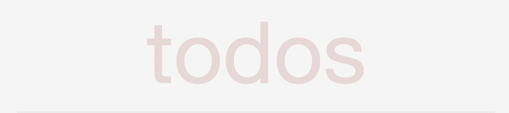
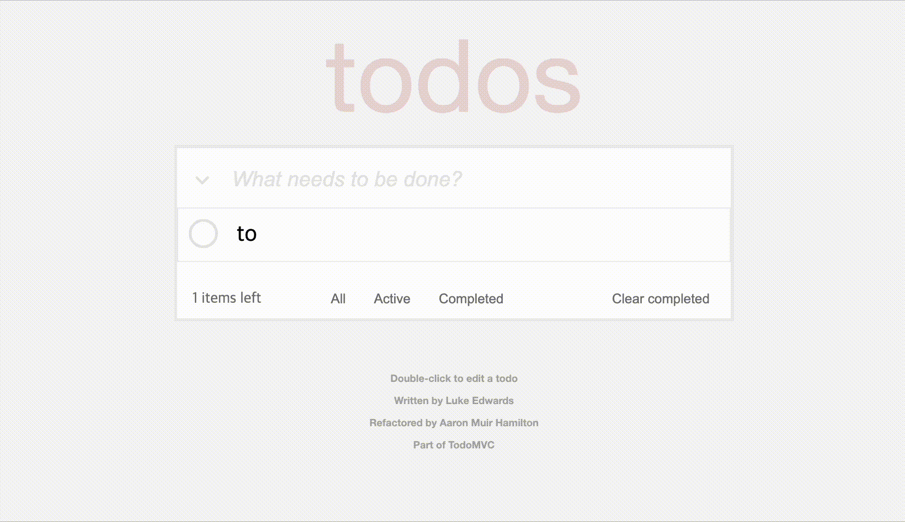

# Todo List MVC ⚽️


>## contents
- [Introduction](#Introduction)  
- [Installation](#Installation)  
- [Tech](#Tech)  

>## Introduction


https://todomvc.com/ 의 Todo List를 구현했습니다. Todo List들은 LocalStorage에 저장되어, 새로고침 후에도 데이터가 삭제되지 않습니다. 
>## Installation
```
1. $ git clone https://github.com/grace7937/JS-to-do-list.git

2. Open with Live Server or Chrome
```
>## Tech
- JavaScript
- HTML
- CSS
- LocalStoage


